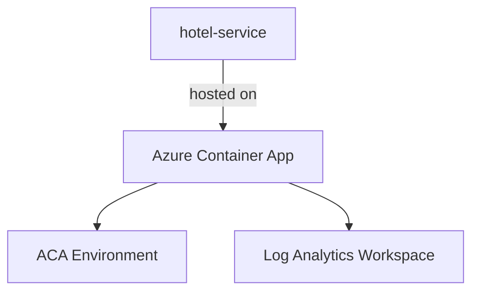

# Azure Deployment Plan for stayease-hotel-service Project

## Goal
Deploy the hotel listing service to Azure Container Apps using AZ CLI and Bicep.

## Project Information
- AppName: stayease-hotel-service
- Stack: Node.js + Express.js
- Type: Hotel Listing microservice with public read endpoints and admin-protected write endpoints
- Containerization: Dockerfile present at `Dockerfile`
- Dependencies: MongoDB Atlas, Auth Service
- Hosting: Azure Container Apps

## Azure Resources Architecture

- The container app serves the Express API on port 3002.
- The app reads MongoDB, Auth Service, and CORS configuration from environment variables.
- Log Analytics collects container logs for deployment validation.

## Recommended Azure Resources
Application stayease-hotel-service:
- Hosting Service Type: Azure Container Apps
- Configuration:
  - language: js
  - Environment Variables: `PORT`, `MONGO_URI`, `AUTH_SERVICE_URL`, `AUTH_VERIFY_PATH`, `CORS_ORIGINS`, `JWT_SECRET`
  - dockerFilePath: `Dockerfile`
  - dockerContext: `.`

## Recommended Supporting Services
- Application Insights
- Log Analytics Workspace

## Recommended Security Configurations
- Store MongoDB URI and JWT secret as Bicep secure parameters or GitHub secrets.
- Expose only the container app ingress endpoint.

## Execution Steps
1. Build the Docker image.
2. Push the image tag `latest` to Docker Hub on `main`.
3. Provision Azure resources with `infra/main.bicep`.
4. Deploy the container app with the Docker Hub image.
5. Validate `/health` and `/docs` after deployment.

## Progress Tracking
- [x] Docker image builds successfully.
- [x] Container port is 3002.
- [ ] Azure Container Apps infrastructure provisioned.
- [ ] Application deployed to Azure.
- [ ] Azure deployment validated.

## Tools Checklist
- [x] appmod-get-plan
- [ ] appmod-get-iac-rules
- [ ] appmod-build-docker-image
- [ ] appmod-summarize-result